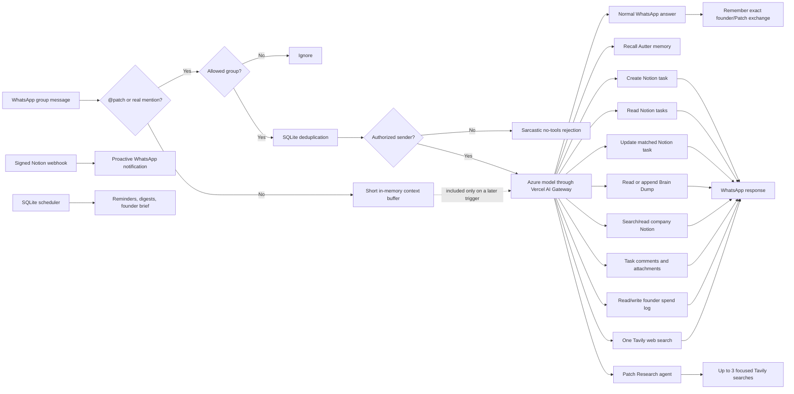

# Captain Patch

[](https://github.com/sagnik11/dia-whatsapp-bot/actions/workflows/ci.yml)
[](https://nodejs.org/)
[](LICENSE)

Captain Patch is an open-source, self-hosted WhatsApp group assistant with an AI personality, founder-only commands, Notion task management, voice and file understanding, proactive briefs, and optional live web search.

It is Autter's sarcastic harbour-master mascot out of the box, but the personality and company context live in one small file and can be replaced for another team, community, family, or product.

```text
@patch summarize what we decided
@patch add a high-priority task to ship the onboarding fix tomorrow
@patch which tasks are due this week?
@patch search the web for today's AI code-review news
@patch comment "Research added" on the publishing task
@patch attach this screenshot to the launch task
```

> [!WARNING]
> This project uses [`whatsapp-web.js`](https://github.com/pedroslopez/whatsapp-web.js), an unofficial automation layer for WhatsApp Web. It is not endorsed or supported by Meta. WhatsApp can change its protocol, log out the linked session, or restrict the account. Use a dedicated, non-critical number and review WhatsApp's terms before deploying it.

## Contents

- [What it does](#what-it-does)
- [How it works](#how-it-works)
- [Quick start with Docker](#quick-start-with-docker)
- [Configure Notion](#configure-notion)
- [Find group and sender IDs](#find-group-and-sender-ids)
- [Enable web search](#enable-web-search)
- [Environment variables](#environment-variables)
- [Deployment](#deployment)
- [Customizing the bot](#customizing-the-bot)
- [Privacy and security model](#privacy-and-security-model)
- [Known limitations](#known-limitations)
- [Troubleshooting](#troubleshooting)
- [Development](#development)
- [Contributing](#contributing)

## What it does

- Listens in WhatsApp **group chats** and responds only when triggered.
- Accepts commands only from explicitly allowlisted WhatsApp accounts.
- Gives unauthorized users a short AI-generated rejection without exposing normal tools.
- Answers ordinary questions through an Azure-hosted model routed by Vercel AI Gateway.
- Optionally gives Autter a self-hosted Supermemory brain that recalls earlier founder conversations across restarts.
- Creates Notion tasks with title, status, due date, assignee, priority, task type, notes, and WhatsApp provenance.
- Reads and filters Notion tasks by title, exact status, and due-date range.
- Optionally batch-adds and reads founder expenses in a separate Notion Daily Spend Log.
- Fully edits an exactly matched task's properties and page-body content.
- Reads and adds comments on exactly matched task pages.
- Understands attached images and PDFs, and can upload attachments to a matched task.
- Transcribes quoted WhatsApp voice notes locally with open-source `whisper.cpp`.
- Optionally reads and appends large notes to one configured Notion Brain Dump page, chunking oversized writes without dropping content.
- Optionally searches and reads company knowledge shared with the Notion integration.
- Stores persistent reminders in SQLite, including advance, due-time, and repeating notifications.
- Optionally posts an incomplete-task digest from Notion on a persistent interval.
- Optionally generates a daily AI founder brief from open tasks and reminders.
- Optionally forwards human Notion task edits and comments into WhatsApp through signed webhooks.
- Optionally performs one bounded Tavily search and returns source URLs.
- Delegates explicit research requests to a separate, multi-search Azure/Luna research agent with cited findings.
- Keeps a short in-memory group context window for follow-up questions.
- Deduplicates messages with SQLite, including current WhatsApp LID message IDs.
- Persists the linked WhatsApp session across Docker rebuilds.
- Runs headlessly on a laptop or Linux VPS, including Amazon Lightsail.
- Ships with TypeScript, ESLint, Vitest, Docker, and GitHub Actions CI.

## Captain Patch and Autter

The default persona is Captain Patch, [Autter's](https://autter.dev/) suspicious harbour master. Patch is dry, highly sarcastic, and unimpressed by bad code, vague plans, avoidable chaos, and meetings that should have been messages. The prompt explicitly keeps the humour non-abusive and requires the useful answer to win over the joke.

The included context describes Autter as an independent assurance layer and merge gate for the AI coding era. It also records Sagnik Ghosh and Tanvi as equal co-founders and close friends. This context is used only as assistant background; WhatsApp authorization still depends exclusively on resolved sender IDs, never names.

To adapt the project for your own organization, see [Customizing the bot](#customizing-the-bot).

## How it works



Authorization happens before the assistant receives access to Notion or web search. An empty sender allowlist fails closed.

The linked WhatsApp client also runs a small scheduler. It reads due reminders, digest state, and daily-brief state from SQLite, then sends proactive messages into configured groups. Only the founder brief calls the AI model; reminders and task digests are deterministic.

When persistent memory is enabled, Patch retrieves the shared Autter profile and relevant historical exchanges before each authorized response. After WhatsApp delivery, it stores the complete addressed exchange under a stable WhatsApp-derived ID. Memory failures fail open: Patch continues answering with its live tools and ordinary context.

## Requirements

Required:

- Node.js 24+ or Docker with Compose
- A dedicated or non-critical WhatsApp account
- A [Vercel AI Gateway API key](https://vercel.com/docs/ai-gateway/authentication-and-byok)
- An Azure model available through AI Gateway using an `azure/<model-name>` identifier
- A [Notion internal integration](https://www.notion.so/profile/integrations) connected to a task database, with read/insert/update/comment capabilities used by the features you enable

Optional:

- A [Tavily API key](https://app.tavily.com/) for live web search
- A VPS such as Amazon Lightsail for continuous operation

## Quick start with Docker

Docker is the simplest path because the image already includes Chromium.

```bash
git clone https://github.com/sagnik11/dia-whatsapp-bot.git
cd dia-whatsapp-bot
cp .env.example .env
```

Fill in the required values in `.env`:

```dotenv
AI_GATEWAY_API_KEY=your_vercel_ai_gateway_key
AI_GATEWAY_MODEL=azure/your-model-name

# Leave disabled until the self-hosted memory service prints its local API key.
SUPERMEMORY_ENABLED=false
SUPERMEMORY_BASE_URL=http://supermemory:6767
SUPERMEMORY_API_KEY=
SUPERMEMORY_SERVER_VERSION=0.0.7-rc.2
SUPERMEMORY_CONTAINER_TAG=autter-company

NOTION_API_KEY=your_notion_integration_token
NOTION_DATA_SOURCE_ID=your_notion_data_source_id
# Optional bounded page context and append-only notes
NOTION_BRAIN_DUMP_PAGE_ID=your_notion_page_id
# Optional founder expense log
NOTION_SPEND_DATA_SOURCE_ID=your_spend_log_data_source_id

BOT_NAME=Captain Patch
BOT_TRIGGER=@patch
TIMEZONE=Asia/Kolkata
```

Build and run in the foreground for the first pairing:

```bash
docker compose up --build dia
```

When the QR code appears:

1. Open WhatsApp on the bot's phone.
2. Go to **Linked devices**.
3. Select **Link a device**.
4. Scan the QR code displayed in the terminal.
5. Wait for `Captain Patch is connected to WhatsApp`.

Stop the foreground process with `Ctrl+C`, configure the group and authorized senders as described below, and start it continuously:

```bash
docker compose up -d
docker compose logs -f --since 2m dia
```

The `dia-data` Docker volume stores the WhatsApp linked-device session and SQLite deduplication database. Rebuilding the container does not normally require scanning another QR.

## Persistent Autter memory with Supermemory

Patch supports the open-source, self-hosted [Supermemory Local](https://github.com/supermemoryai/supermemory) server. It uses the existing Vercel AI Gateway credential and Azure model for extraction, local `Xenova/bge-base-en-v1.5` embeddings for retrieval, and a separate persistent Docker volume.

The image currently pins `SUPERMEMORY_SERVER_VERSION=0.0.7-rc.2`. Stable `0.0.6` has an upstream standalone-binary packaging regression that omits `@rivetkit/rivetkit-wasm`, leaving every ingested document queued indefinitely. The pinned release upgrades the cached binary at container startup without deleting the persistent graph or API key.

The memory service is behind an explicit Compose profile, so it is not started for deployments that do not enable memory. Bootstrap it once:

```bash
docker compose --profile memory up -d --build supermemory
docker compose logs -f supermemory
```

On first boot, look for the local `sm_...` API key. Keep it secret and add it to `.env`:

```dotenv
SUPERMEMORY_ENABLED=true
SUPERMEMORY_BASE_URL=http://supermemory:6767
SUPERMEMORY_API_KEY=sm_your_generated_local_key
SUPERMEMORY_SERVER_VERSION=0.0.7-rc.2
SUPERMEMORY_CONTAINER_TAG=autter-company
```

Then start the full stack with the profile enabled:

```bash
docker compose --profile memory up -d --build
docker compose ps
docker compose logs -f --since 2m dia supermemory
```

Keep using `--profile memory` for Compose updates that should include the memory service. Both containers share only the internal Compose network; port 6767 is not published to the internet. `supermemory-data` holds the graph, authentication state, and local embedding model cache.

### What Patch remembers

For every authorized founder message addressed to Patch, memory stores:

- The exact original message, including `@patch`.
- Founder name and WhatsApp ID, group, message ID, and recording time.
- Any explicitly quoted message.
- Attachment names and complete voice-note transcripts.
- Patch's complete delivered reply, including task/spend/reminder confirmations and research.

It does not store ambient untriggered group chatter, unauthorized commands/rejections, or base64 attachment bytes. Images and documents are represented by their names plus Patch's resulting exchange; the existing model still inspects them during the live request.

All Autter exchanges use one shared container, `autter-company`, so both authorized co-founders benefit from the same organizational memory. Replayed WhatsApp messages use the same `customId`, preventing a restart or retry from creating a second source document.

Memory is historical context, not an operational database. The precedence enforced in the assistant is:

```text
fresh Notion/SQLite tool results → current founder request → recalled memory → ambient chat context
```

Patch therefore still reads Notion for current tasks and spend totals, and SQLite for current reminders. A stale recollection cannot override those live systems.

On a small Lightsail instance, the Compose profile limits Supermemory ingestion to one concurrent job, one embedding worker/thread, and 512 MB of ingestion headroom. Every exchange is stored whole; `SUPERMEMORY_RECALL_LIMIT` controls only how many relevant results are injected into one model request. Chromium, local Whisper, and local embeddings can make a 2 GB instance tight under concurrent work; 4 GB is the safer starting point for the complete stack, and `docker stats` shows whether the instance is swapping or approaching its limit.

## Run directly with Node.js

For local development or a host with Chrome/Chromium already available:

```bash
git clone https://github.com/sagnik11/dia-whatsapp-bot.git
cd dia-whatsapp-bot
npm install
cp .env.example .env
npm run dev
```

If Puppeteer cannot locate a browser, set `PUPPETEER_EXECUTABLE_PATH` to the Chrome or Chromium executable.

## Configure Notion

Create a Notion internal integration with **Read content**, **Insert content**, and **Update content** capabilities, then add that integration as a connection to the task database. Update content is needed only for optional Brain Dump appends.

The default schema is:

| Property | Notion type | Expected values |
| --- | --- | --- |
| `Task name` | Title | Any task title |
| `Status` | Status | Must contain `Not started` unless overridden |
| `Due date` | Date | Optional |
| `Assignee` | People | Optional |
| `Priority` | Select | `High`, `Med`, `Low` |
| `Task type` | Multi-select | `Tech`, `Marketing`, `Content`, `Misc`, `Product` |

Property names are configurable. Property **types and option names** must still match the tool schemas in the current implementation.

Notion API versions from 2025-09-03 onward distinguish a database container from its data sources. `NOTION_DATA_SOURCE_ID` must be the data source ID, not merely the parent database ID.

### Assignee mapping

Notion people properties require user IDs rather than display names. Configure a default and optional case-insensitive aliases:

```dotenv
NOTION_DEFAULT_ASSIGNEE_ID=notion-user-id-for-you
NOTION_ASSIGNEE_MAP_JSON={"sagnik":"user-id-1","tanvi":"user-id-2"}
```

Unknown names remain unassigned, but the requested name is preserved in the task page body.

### Optional founder spend log

Connect the same Notion integration to a separate expense database and set its **data source ID**:

```dotenv
NOTION_SPEND_DATA_SOURCE_ID=your_spend_log_data_source_id
# Optional; falls back to NOTION_ASSIGNEE_MAP_JSON when blank.
NOTION_SPEND_PAYER_MAP_JSON={"sagnik":"notion-user-id-1","tanvi":"notion-user-id-2"}
```

The database schema is intentionally fixed so amounts and totals remain reliable:

| Property | Notion type | Expected values |
| --- | --- | --- |
| `Spend` | Title | Purchase description |
| `Amount` | Number | INR amount |
| `Date` | Date | Transaction date |
| `Paid by` | People | Founder from the payer map |
| `Payment method` | Select | `Company card`, `Personal card`, `UPI`, `Bank transfer`, `Cash` |
| `Category` | Select | `Travel`, `Software & SaaS`, `Hosting & Infrastructure`, `Meals`, `Marketing`, `Contractors`, `Office`, `Legal & Finance`, `Other` |
| `Vendor` | Text | Optional merchant |
| `Notes` | Text | Optional context plus a private retry reference |
| `Reimbursable` | Checkbox | Defaults to false unless explicitly stated |

Patch accepts a single transaction or a numbered bulk list, creates one Notion row for each expense, resolves relative dates in `TIMEZONE`, and confirms the created count and INR total. Each row gets a hashed reference derived from the WhatsApp message and item position; replaying the same message skips rows already created instead of duplicating them. A newly retyped message is treated as a new instruction.

```text
@patch add to daily spend log:
Expenses by Tanvi:
1. 12th aug: chai 100rs upi
2. 12th aug: bookbar 253rs upi

@patch how much did Tanvi spend on travel this month?
@patch show our expenses from 10 August to 13 August
```

The integration needs **Read content** and **Insert content** access to this database. The model uses the closest configured category and chooses `Other` when uncertain; it asks for clarification instead of guessing a genuinely ambiguous date or amount.

### Existing-task updates

Captain Patch can update the title, status, due date, assignee, priority, task types, and page-body content of one existing task. It first searches the task tracker, accepts only a page ID returned by that search in the same request, and refuses ambiguous bulk changes.

```text
@patch move Feedbacks from Intern Applications from Completed to In progress and assign it to Tanvi
@patch add the interview notes to the Feedbacks from Intern Applications task page
@patch change the launch task priority to High and its due date to Friday
```

Notes are appended by default. Patch replaces the complete task-page body only when explicitly asked to replace or rewrite it, and it will not delete nested child pages/databases during a replacement. Properties can be cleared only by an explicit request. Assignee changes require the name in `NOTION_ASSIGNEE_MAP_JSON`; redundant writes are skipped. The Notion integration needs **Update content** capability.

### Task comments and attachments

Patch can read existing comments, add a comment, and upload a WhatsApp attachment to one exactly matched task. As with edits, it must search the tracker first and refuses ambiguous matches.

```text
@patch show the comments on the publishing task
@patch comment "Research is ready for review" on the publishing task
@patch attach this screenshot to the launch task
```

For attachment commands, send the file with the command as its caption, or reply `@patch attach this to the launch task` to the message containing the file. The Notion integration needs the relevant **Read content**, **Insert content**, **Update content**, and comment capabilities. Upload size is also bounded by `MEDIA_MAX_BYTES`.

### Optional Brain Dump access

To let Captain Patch answer questions from one Notion page, add the same internal integration as a connection to that page and set:

```dotenv
NOTION_BRAIN_DUMP_PAGE_ID=your_notion_page_id
```

The page can be a regular Notion page; it does not need to be a database. Captain Patch reads it only when an authorized founder asks about its contents and appends only when explicitly told to add something. The integration needs **Read content** and **Update content** capabilities plus access to the page. Existing content cannot be replaced, edited, or deleted through the bot. Reads are capped at 12,000 characters per model request. Appends have no application-level total-character ceiling: Patch divides unusually large Markdown into ordered Notion requests while preserving the complete note. General workspace search remains disabled unless the separate setting below is enabled.

If one message asks Patch to research and save the result, Patch runs the research agent first and then appends two clearly separated sections: the founder's complete original notes and Patch's complete cited report.

Examples:

```text
@patch summarize the Brain Dump
@patch add this to the Brain Dump: make the first repository review memorable
@patch append the quoted feedback to the Brain Dump under Onboarding
@patch research these launch ideas and add my complete notes and your findings separately to the Brain Dump
```

### Optional company knowledge access

Set this only after reviewing the integration's **Content access** in the Notion developer portal:

```dotenv
NOTION_KNOWLEDGE_ENABLED=true
```

This exposes read-only assistant tools that search page/database titles shared with the integration, read matched pages, and inspect the five most recently edited rows of matched databases. A page can be read only after its ID was returned by a search in the same WhatsApp request. The bot permits one title search and two resource reads per request; page bodies are capped at 12,000 characters.

The public Notion API does not provide a teamspace filter. To scope this to one teamspace such as Autter HQ, connect the integration only to that teamspace's top-level pages and databases. Sharing a parent page includes its descendants. If some databases are separate top-level sidebar entries, add each one to the integration's Content access as well.

Examples:

```text
@patch search Autter HQ for our company goals
@patch what does our Notion say about expenses?
@patch summarize the latest weekly product update from company knowledge
```

## Voice notes, screenshots, and PDFs

Images and PDFs are sent to the existing `AI_GATEWAY_MODEL` for multimodal understanding. For this deployment that is `azure/gpt-luna`; no second hosted model is required. `AI_GATEWAY_MEDIA_MODEL` remains an optional override for other users. You can send media with an `@patch` caption or reply with an `@patch` command to an existing media message.

Voice notes are transcribed first by a private [`whisper.cpp`](https://github.com/ggml-org/whisper.cpp) service in Docker Compose. Because WhatsApp voice notes do not carry a normal text caption, reply to the voice note with `@patch summarize this` (or another command).

```dotenv
AI_GATEWAY_MODEL=azure/gpt-luna
AI_GATEWAY_MEDIA_MODEL=
WHISPER_MODEL=tiny
WHISPER_THREADS=2
WHISPER_LANGUAGE=auto
MEDIA_MAX_BYTES=5000000
```

The default multilingual `tiny` model is about 75 MiB on disk and uses roughly 273 MB of memory. Change `WHISPER_MODEL=base` for better accuracy at the cost of slower CPU inference, about 142 MiB on disk, and roughly 388 MB of memory. The model is downloaded once into the `whisper-models` Docker volume. Audio never goes to a transcription API; Luna receives only the resulting transcript. Transcripts, images, and documents are treated as untrusted user content.

## Reminders and proactive task digests

Reminders are stored in the same persistent SQLite file as message deduplication, so container rebuilds and restarts do not erase them. By default Patch asks the model to schedule an advance notification ten minutes before the due time and another when due. Repetition is added only when explicitly requested and continues until cancelled.

```text
@patch remind me to send the investor update tomorrow at 4 PM
@patch remind me every 30 minutes after 6 PM to check the launch
@patch show my reminders
@patch cancel reminder 12
```

The reminder confirmation includes its numeric ID. A reminder belongs to the WhatsApp group where it was created, and cancellation is limited to that group.

The incomplete-task digest is disabled by default. To send one immediately after first startup and then every four hours:

```dotenv
TASK_DIGEST_INTERVAL_HOURS=4
TASK_DIGEST_GROUP_IDS=120363000000000000@g.us
```

If `TASK_DIGEST_GROUP_IDS` is empty, it uses `ALLOWED_GROUP_IDS`. The digest excludes statuses commonly treated as terminal (`Complete`, `Completed`, `Done`, `Cancelled`, `Canceled`, and `Archived`), includes due dates and assignees, paginates through the tracker, and splits long digests across WhatsApp messages. Its next delivery time is persisted in SQLite, so a restart does not restart the four-hour clock.

### Daily founder brief

The daily brief synthesizes incomplete Notion tasks and active reminders into a short prioritized WhatsApp update:

```dotenv
FOUNDER_BRIEF_TIME=09:00
FOUNDER_BRIEF_GROUP_IDS=120363000000000000@g.us
```

The time uses `TIMEZONE`. If the group list is empty, Patch uses `ALLOWED_GROUP_IDS`. Unlike the deterministic four-hour digest, this feature calls `AI_GATEWAY_MODEL` once per destination per day.

## Notion change notifications

Patch can receive signed Notion webhooks for task creation, task property/page changes, and new or updated comments, then post compact notifications to WhatsApp. Bot-authored events are ignored by default to prevent Patch's own writes from echoing back.

This requires a public HTTPS endpoint; the Docker port is intentionally bound only to `127.0.0.1` and should sit behind Caddy, nginx, a tunnel, or another TLS reverse proxy. Configure:

```dotenv
NOTION_WEBHOOK_ENABLED=true
NOTION_WEBHOOK_PORT=3000
NOTION_WEBHOOK_PATH=/notion/webhook
NOTION_NOTIFICATION_GROUP_IDS=120363000000000000@g.us
NOTION_NOTIFY_BOT_EVENTS=false
```

Create a Notion webhook subscription pointing to `https://YOUR_DOMAIN/notion/webhook`. On the initial verification request, Patch logs `verificationToken`. Copy that value into `NOTION_WEBHOOK_VERIFICATION_TOKEN`, restart the container, and keep the token secret. Subsequent deliveries are rejected unless their `X-Notion-Signature` is valid. See the [Lightsail guide](docs/lightsail.md#optional-public-https-for-notion-webhooks) for a Caddy setup.

## Find group and sender IDs

### Group allowlist

With `LIST_GROUPS_ON_START=true`, startup logs show joined group names and IDs:

```text
{"groupId":"120363000000000000@g.us","groupName":"Example","msg":"Available WhatsApp group"}
```

Set one or more comma-separated IDs:

```dotenv
ALLOWED_GROUP_IDS=120363000000000000@g.us
LIST_GROUPS_ON_START=false
```

If `ALLOWED_GROUP_IDS` is empty, every joined group is eligible. A production deployment should normally use an explicit allowlist.

### Authorized senders

`AUTHORIZED_USER_IDS` is required in practice: when it is empty, every trigger is rejected.

To discover an owner's identifiers:

1. Start the bot and follow its logs.
2. Ask the owner to send `@patch hello` in an allowed group.
3. Find the `Ignored trigger from unauthorized sender` entry.
4. Copy all relevant values from its `senderIds` array.
5. Add every owner account as a comma-separated value.

Example with two owners:

```dotenv
AUTHORIZED_USER_IDS=123456789@lid,919999999999@c.us,919999999999,987654321@lid,918888888888@c.us,918888888888
```

WhatsApp may represent the same person using both `@lid` and `@c.us` identifiers. Include the variants observed in your logs. Display names are deliberately never used for authorization.

Messages manually sent from the WhatsApp account linked to the bot are also supported when that account's ID is included in the allowlist.

## Enable web search

Live search is optional:

```dotenv
TAVILY_API_KEY=tvly-your-key
RESEARCH_MAX_SEARCHES=3
```

When configured, Patch has two modes:

- Quick lookup: one bounded search for a current fact or URL.
- Delegated research: one specialist run with up to `RESEARCH_MAX_SEARCHES` distinct searches, a cited report, explicit unknowns, and a recommendation.

Authorized assistant and research responses do not set an application-level output-token ceiling. Long standalone reports are delivered as consecutive, paragraph-aware WhatsApp messages instead of being discarded or shortened.

Examples:

```text
@patch research the best places to launch Autter to developers
@patch do a competitive analysis of AI code review tools
@patch research publishing channels and append the report to the publishing task
```

Every individual Tavily call still uses these server-enforced limits:

- At most one Tavily request per triggered WhatsApp message
- Basic search depth
- At most five results
- No raw page content, answer generation, or images
- A 15-second timeout
- At most 1,200 characters retained from each result

This keeps cost and model context bounded. Without a Tavily key, the assistant continues to work but must say that live browsing is unavailable when asked for current information.

## Environment variables

Copy [`.env.example`](.env.example) and change only what your deployment needs.

| Variable | Required | Default | Purpose |
| --- | --- | --- | --- |
| `AI_GATEWAY_API_KEY` | Yes | — | Vercel AI Gateway credential. |
| `AI_GATEWAY_BASE_URL` | No | `https://ai-gateway.vercel.sh/v1` | OpenAI-compatible Gateway base URL. |
| `AI_GATEWAY_MODEL` | Yes | — | Model ID; must match `azure/<model-name>`. |
| `AI_GATEWAY_MEDIA_MODEL` | No | `AI_GATEWAY_MODEL` | Optional Azure override for images/documents; leave blank to use Luna. |
| `SUPERMEMORY_ENABLED` | No | `false` | Enables recall and complete authorized-exchange ingestion. |
| `SUPERMEMORY_BASE_URL` | When enabled | `http://supermemory:6767` | Self-hosted or compatible Supermemory API URL. |
| `SUPERMEMORY_API_KEY` | When enabled | Empty | Bearer key printed by the local server on first boot. |
| `SUPERMEMORY_CONTAINER_TAG` | No | `autter-company` | Shared company-memory isolation boundary. |
| `SUPERMEMORY_RECALL_LIMIT` | No | `12` | Relevant memory results retrieved per request; does not limit stored exchange size or Luna output. |
| `SUPERMEMORY_RECALL_THRESHOLD` | No | `0.35` | Minimum relevance score from `0` to `1`. |
| `SUPERMEMORY_TIMEOUT_MS` | No | `20000` | Per-request memory-service timeout; failures do not stop Patch. |
| `WHISPER_MODEL` | No | `tiny` | Local whisper.cpp multilingual model downloaded by Compose; `base` improves accuracy. |
| `WHISPER_THREADS` | No | `2` | CPU threads assigned to local transcription. |
| `WHISPER_LANGUAGE` | No | `auto` | Spoken-language hint sent to local Whisper. |
| `WHISPER_TIMEOUT_MS` | No | `180000` | Maximum local transcription request duration. |
| `WHISPER_TRANSCRIPTION_URL` | No | Compose-managed | Local whisper.cpp inference URL for non-Compose runs. |
| `NOTION_API_KEY` | Yes | — | Notion internal integration token. |
| `NOTION_DATA_SOURCE_ID` | Yes | — | Task tracker's data source ID. |
| `NOTION_BRAIN_DUMP_PAGE_ID` | No | Empty | Enables bounded reads and append-only notes for one specific page. |
| `NOTION_KNOWLEDGE_ENABLED` | No | `false` | Searches and reads all content shared with the Notion integration. Review Content access first. |
| `NOTION_TITLE_PROPERTY` | No | `Task name` | Title property name. |
| `NOTION_STATUS_PROPERTY` | No | `Status` | Status property name. |
| `NOTION_DEFAULT_STATUS` | No | `Not started` | Status assigned to new tasks. |
| `NOTION_DUE_DATE_PROPERTY` | No | `Due date` | Date property name. |
| `NOTION_ASSIGNEE_PROPERTY` | No | `Assignee` | People property name. |
| `NOTION_DEFAULT_ASSIGNEE_ID` | No | Empty | Default Notion user ID. |
| `NOTION_ASSIGNEE_MAP_JSON` | No | `{}` | JSON mapping of names to Notion user IDs. |
| `NOTION_SPEND_DATA_SOURCE_ID` | No | Empty | Enables read/write access to a separate Daily Spend Log data source. |
| `NOTION_SPEND_PAYER_MAP_JSON` | No | `NOTION_ASSIGNEE_MAP_JSON` | Optional JSON mapping of payer names to Notion user IDs. |
| `NOTION_PRIORITY_PROPERTY` | No | `Priority` | Select property name. |
| `NOTION_TASK_TYPE_PROPERTY` | No | `Task type` | Multi-select property name. |
| `TAVILY_API_KEY` | No | Empty | Enables quick web lookup and delegated research. |
| `RESEARCH_MAX_SEARCHES` | No | `3` | Maximum distinct Tavily searches in one research run; range `1-5`. |
| `BOT_NAME` | No | `Captain Patch` | Name supplied to the model and logs. |
| `BOT_TRIGGER` | No | `@patch` | Case-insensitive text trigger. |
| `TIMEZONE` | No | `Asia/Kolkata` | IANA timezone used for relative dates. |
| `ALLOWED_GROUP_IDS` | Recommended | Empty | Comma-separated WhatsApp group IDs; empty allows all joined groups. |
| `AUTHORIZED_USER_IDS` | Yes for use | Empty | Comma-separated owner IDs; empty blocks everyone. |
| `UNAUTHORIZED_REPLY` | No | Harbour-themed fallback | Used only if AI rejection generation fails. |
| `CONTEXT_MESSAGE_LIMIT` | No | `6` | Recent group messages retained in memory; `0` disables context. Maximum `20`. |
| `TASK_DIGEST_INTERVAL_HOURS` | No | `0` | Incomplete-task digest interval; `0` disables it. Use `4` for four-hour digests. |
| `TASK_DIGEST_GROUP_IDS` | No | `ALLOWED_GROUP_IDS` | Optional comma-separated proactive digest destinations. |
| `FOUNDER_BRIEF_TIME` | No | Empty | Daily brief time in `HH:mm`; empty disables it. |
| `FOUNDER_BRIEF_GROUP_IDS` | No | `ALLOWED_GROUP_IDS` | Optional comma-separated daily-brief destinations. |
| `MEDIA_MAX_BYTES` | No | `5000000` | Maximum decoded WhatsApp attachment size. |
| `NOTION_WEBHOOK_ENABLED` | No | `false` | Starts the Notion webhook receiver. |
| `NOTION_WEBHOOK_PORT` | No | `3000` | Local webhook HTTP port. |
| `NOTION_WEBHOOK_PATH` | No | `/notion/webhook` | Webhook URL path. |
| `NOTION_WEBHOOK_VERIFICATION_TOKEN` | After verification | Empty | Secret used to verify Notion webhook signatures. |
| `NOTION_NOTIFICATION_GROUP_IDS` | No | `ALLOWED_GROUP_IDS` | WhatsApp destinations for Notion events. |
| `NOTION_NOTIFY_BOT_EVENTS` | No | `false` | Includes integration-authored events; normally keep false. |
| `LIST_GROUPS_ON_START` | No | `true` | Logs group names/IDs after connecting. Disable after configuration. |
| `DATA_DIR` | No | `.data` | WhatsApp session and SQLite directory outside Docker. |
| `LOG_LEVEL` | No | `info` | Pino log level such as `debug`, `info`, or `warn`. |
| `PUPPETEER_EXECUTABLE_PATH` | No | Auto | Explicit Chrome/Chromium executable. Docker sets `/usr/bin/chromium`. |

## Deployment

Captain Patch needs a continuously running process. Your laptop does not need to stay on when the bot runs on a VPS.

For a full Ubuntu deployment—including Docker installation, SSH key use, terminal QR pairing, firewall guidance, updates, and backups—see [Deploy Captain Patch on Amazon Lightsail](docs/lightsail.md).

Update an existing Docker deployment with:

```bash
git pull --ff-only origin main
docker compose --profile memory build --no-cache
docker compose --profile memory up -d --force-recreate
docker compose logs -f --since 2m dia supermemory
```

Omit `--profile memory` and `supermemory` when persistent memory is disabled. Do not run `docker compose down --volumes` unless you intentionally want to remove the saved WhatsApp session, deduplication/reminder database, Whisper model cache, and Supermemory graph.

## Customizing the bot

This repository is reusable even though the default character belongs to Autter.

1. Change `BOT_NAME` and `BOT_TRIGGER` in `.env`.
2. Replace `CAPTAIN_PATCH_PERSONA` and `AUTTER_CONTEXT` in [`src/captain-patch.ts`](src/captain-patch.ts).
3. Change `UNAUTHORIZED_REPLY` in `.env`.
4. Adjust the Notion property names in `.env`.
5. Rename the WhatsApp account's visible profile separately in WhatsApp settings.
6. Run `npm run check` and `npm run build` before deploying.

Do not put API keys, private customer data, phone numbers, or other secrets into the persona file. It is included in every authorized model request and committed to source control.

## Privacy and security model

- Authorization uses WhatsApp sender IDs, not editable profile names.
- Group and sender allowlists are checked before AI tools are exposed.
- The unauthorized rejection call has no Notion or web-search tools.
- Task creation uses the strict `create_notion_task` schema; Brain Dump writes can only append to the configured page. Large appends are split into ordered transport-sized requests rather than truncated.
- Existing-task updates require an exact result from the same request; whole-page replacement must be explicit and cannot delete nested child pages or databases.
- Task reads return selected properties; Brain Dump reads are confined to one configured page and capped at 12,000 characters.
- Company knowledge is opt-in, read-only in the bot, and limited to one title search plus two matched resource reads per request.
- Notion's API has no teamspace filter; the integration's Content access is the security boundary for company knowledge.
- Quick web lookup is limited to one Tavily call. An explicit delegated research run is limited to `RESEARCH_MAX_SEARCHES` distinct calls and can run only once per trigger.
- Group context, Notion records, and web results are explicitly treated as untrusted data in the system prompt.
- Ordinary messages are buffered only in memory. They are not processed immediately, but up to `CONTEXT_MESSAGE_LIMIT` recent messages can be sent to the AI Gateway when a later authorized trigger occurs.
- When Supermemory is enabled, every authorized message addressed to Patch and Patch's full delivered reply are durably stored in the private `supermemory-data` volume. This includes quoted text and complete voice transcripts; it excludes ambient untriggered chat, unauthorized commands, and raw attachment bytes.
- Recall is sent back through Vercel AI Gateway and the configured Azure model as prompt context. Treat the Supermemory API key and volume as sensitive, and do not address passwords, private keys, or other secrets to Patch.
- Triggered message bodies, resolved sender IDs, and outgoing replies are written to application logs.
- Reminder text, schedules, requester IDs, group IDs, and digest schedule state are stored in the SQLite database.
- The `dia-data` Docker volume contains a reusable WhatsApp linked-device session and must be treated as sensitive. The separate `whisper-models` volume contains only public model weights.
- `.env`, `.data`, WhatsApp auth directories, logs, and build output are excluded by `.gitignore`.

Before adding the bot to a group, tell participants what data may be processed by Vercel AI Gateway, the selected Azure model provider, Notion, Tavily, and your server logs.

Report vulnerabilities privately according to [SECURITY.md](SECURITY.md).

## Known limitations

- WhatsApp integration is unofficial and can break when WhatsApp Web changes.
- Only group chats are handled; direct messages are ignored.
- Voice transcription is CPU-bound and may take a while on the smallest Lightsail plan; image/PDF understanding depends on the selected Azure deployment's multimodal support.
- Media must fit `MEDIA_MAX_BYTES`; reply with an `@patch` command when the original media message cannot carry a caption.
- The current model configuration intentionally requires an `azure/...` Gateway model.
- Notion is required at startup even if you only want ordinary AI answers.
- Notion task property types and select options are currently fixed in code.
- Brain Dump access supports one configured page, bounded reads, and append-only writes; it cannot modify existing notes.
- Reminder delivery is at-least-once: a crash after WhatsApp accepts a message but before SQLite advances it can cause one duplicate notification.
- Webhook notifications are also at-least-once around the small interval between WhatsApp delivery and the SQLite deduplication write.
- Repeating reminders continue until explicitly cancelled; the bot cannot infer that the underlying real-world action was completed.
- The task digest recognizes a fixed set of terminal status names; customize `isIncompleteTaskStatus` if your tracker uses different completion labels.
- Company knowledge search matches titles, not arbitrary page-body text, and database reads return only the five most recently edited rows before an individual row is opened.
- Context is in-memory and is lost when the process restarts.
- SQLite and local session storage assume a single bot process, not horizontal scaling.
- A linked WhatsApp session can be paused or logged out and may require QR pairing again.

## Troubleshooting

### The bot connects but does not reply

Check, in order:

1. The message was sent in a group.
2. It contains the configured text trigger or a real mention of the linked account.
3. The group is present in `ALLOWED_GROUP_IDS`.
4. The sender's observed IDs are present in `AUTHORIZED_USER_IDS`.
5. Logs contain `Received triggered WhatsApp message`.

```bash
docker compose ps
docker compose logs --since 5m dia
```

### An owner receives the unauthorized rejection

Copy every relevant `@lid`, `@c.us`, and raw-number variant from the `senderIds` log entry into `AUTHORIZED_USER_IDS`, then recreate the container so it reloads `.env`:

```bash
docker compose --profile memory up -d --force-recreate
```

Omit `--profile memory` if `SUPERMEMORY_ENABLED=false`.

### Notion returns 403 or 404

- Enable **Read content** and **Insert content** for the integration.
- Share the original task database with that integration.
- Confirm `NOTION_DATA_SOURCE_ID` is a data source ID.
- Confirm configured property names exactly match Notion.

### WhatsApp asks for another QR

The linked session was logged out, invalidated, or removed. Run the service in the foreground and pair again. Avoid deleting the Docker volume during normal updates.

### Chromium crashes or repeatedly restarts

Use the current `main` image, allow stale-profile lock cleanup to run, and ensure the host has enough memory. Chromium and Node.js need at least 2 GB RAM; the full stack with local Whisper and Supermemory is safer with 4 GB.

### Supermemory is unavailable

Patch fails open: current messages, Notion tools, reminders, and ordinary replies continue without recalled context. Inspect the private sidecar, verify that `.env` contains the generated `sm_...` key, and recreate both services:

```bash
docker compose --profile memory ps
docker compose --profile memory logs --tail 200 supermemory dia
docker compose --profile memory up -d --force-recreate
```

### Web search is unavailable

Confirm `TAVILY_API_KEY` exists inside `.env`, recreate the container, and inspect `Web search failed` log entries. The assistant deliberately does not pretend to browse when Tavily is unavailable.

## Development

```bash
npm install
npm run check
npm run build
```

Individual commands:

```bash
npm run lint
npm run typecheck
npm test
npm run test:watch
```

The test suite covers trigger routing, owner authorization, current and legacy WhatsApp IDs, message deduplication, complete Supermemory exchange capture and fail-open recall, Chromium profile cleanup, task updates/comments/uploads, founder spend-log reads and retry-safe batch writes, media limits, persistent reminders, proactive scheduling, incomplete-task digests, daily-brief scheduling, Notion webhook formatting, bounded Brain Dump reads, append-only writes, scoped knowledge search/read loops, delegated research, task confirmations, and Tavily request bounds.

## Project structure

```text
src/
├── assistant.ts          AI instructions and tool orchestration
├── authorization.ts      WhatsApp sender-ID normalization and allowlist
├── bot.ts                WhatsApp lifecycle and message routing
├── captain-patch.ts      Replaceable persona and Autter context
├── config.ts             Validated environment configuration
├── context-buffer.ts     Bounded in-memory group context
├── dedupe-store.ts       SQLite message deduplication
├── founder-brief.ts      Daily AI brief generation
├── media-ingestion.ts    Attachment validation and voice transcription
├── memory.ts             Shared Supermemory recall and exact exchange ingestion
├── notion-webhook.ts     Signed Notion event receiver and notifications
├── notion.ts             Strict Notion tasks, Brain Dump, and knowledge service
├── notion-spend.ts       Founder expense reads, batch writes, and retry safety
├── reminder-store.ts     Persistent reminder and scheduler state
├── research-agent.ts     Bounded multi-search research specialist
├── scheduler.ts          Proactive reminder and task-digest delivery
└── web-search.ts         Bounded Tavily search service

docs/lightsail.md         Production VPS deployment guide
patches/                  Compatibility patch for whatsapp-web.js
test/                     Vitest test suite
```

## Contributing

Issues and focused pull requests are welcome. Read [CONTRIBUTING.md](CONTRIBUTING.md), add tests for behavioral changes, and run the full check before opening a PR:

```bash
npm run check && npm run build
```

Never include real phone numbers, group IDs, API keys, session files, private messages, or unredacted logs in an issue or commit.

## License

Released under the [MIT License](LICENSE).

Captain Patch and Autter product context are included as the default example persona. If you publish a materially rebranded fork, replace the persona and company context with your own.
