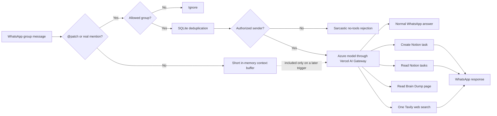

# Captain Patch

[](https://github.com/sagnik11/dia-whatsapp-bot/actions/workflows/ci.yml)
[](https://nodejs.org/)
[](LICENSE)

Captain Patch is an open-source, self-hosted WhatsApp group assistant with an AI personality, owner-only commands, Notion task management, and optional live web search.

It is Autter's sarcastic harbour-master mascot out of the box, but the personality and company context live in one small file and can be replaced for another team, community, family, or product.

```text
@patch summarize what we decided
@patch add a high-priority task to ship the onboarding fix tomorrow
@patch which tasks are due this week?
@patch search the web for today's AI code-review news
```

> [!WARNING]
> This project uses [`whatsapp-web.js`](https://github.com/pedroslopez/whatsapp-web.js), an unofficial automation layer for WhatsApp Web. It is not endorsed or supported by Meta. WhatsApp can change its protocol, log out the linked session, or restrict the account. Use a dedicated, non-critical number and review WhatsApp's terms before deploying it.

## Contents

- [What it does](#what-it-does)
- [How it works](#how-it-works)
- [Quick start with Docker](#quick-start-with-docker)
- [Configure Notion](#configure-notion)
- [Find group and sender IDs](#find-group-and-sender-ids)
- [Enable web search](#enable-web-search)
- [Environment variables](#environment-variables)
- [Deployment](#deployment)
- [Customizing the bot](#customizing-the-bot)
- [Privacy and security model](#privacy-and-security-model)
- [Known limitations](#known-limitations)
- [Troubleshooting](#troubleshooting)
- [Development](#development)
- [Contributing](#contributing)

## What it does

- Listens in WhatsApp **group chats** and responds only when triggered.
- Accepts commands only from explicitly allowlisted WhatsApp accounts.
- Gives unauthorized users a short AI-generated rejection without exposing normal tools.
- Answers ordinary questions through an Azure-hosted model routed by Vercel AI Gateway.
- Creates Notion tasks with title, status, due date, assignee, priority, task type, notes, and WhatsApp provenance.
- Reads and filters Notion tasks by title, exact status, and due-date range.
- Optionally reads one configured Notion Brain Dump page for summaries and product context.
- Optionally performs one bounded Tavily search and returns source URLs.
- Keeps a short in-memory group context window for follow-up questions.
- Deduplicates messages with SQLite, including current WhatsApp LID message IDs.
- Persists the linked WhatsApp session across Docker rebuilds.
- Runs headlessly on a laptop or Linux VPS, including Amazon Lightsail.
- Ships with TypeScript, ESLint, Vitest, Docker, and GitHub Actions CI.

## Captain Patch and Autter

The default persona is Captain Patch, [Autter's](https://autter.dev/) suspicious harbour master. Patch is dry, highly sarcastic, and unimpressed by bad code, vague plans, avoidable chaos, and meetings that should have been messages. The prompt explicitly keeps the humour non-abusive and requires the useful answer to win over the joke.

The included context describes Autter as an independent assurance layer and merge gate for the AI coding era. It also records Sagnik Ghosh and Tanvi as equal co-founders and close friends. This context is used only as assistant background; WhatsApp authorization still depends exclusively on resolved sender IDs, never names.

To adapt the project for your own organization, see [Customizing the bot](#customizing-the-bot).

## How it works



Authorization happens before the assistant receives access to Notion or web search. An empty sender allowlist fails closed.

## Requirements

Required:

- Node.js 24+ or Docker with Compose
- A dedicated or non-critical WhatsApp account
- A [Vercel AI Gateway API key](https://vercel.com/docs/ai-gateway/authentication-and-byok)
- An Azure model available through AI Gateway using an `azure/<model-name>` identifier
- A [Notion internal integration](https://www.notion.so/profile/integrations) connected to a task database

Optional:

- A [Tavily API key](https://app.tavily.com/) for live web search
- A VPS such as Amazon Lightsail for continuous operation

## Quick start with Docker

Docker is the simplest path because the image already includes Chromium.

```bash
git clone https://github.com/sagnik11/dia-whatsapp-bot.git
cd dia-whatsapp-bot
cp .env.example .env
```

Fill in the required values in `.env`:

```dotenv
AI_GATEWAY_API_KEY=your_vercel_ai_gateway_key
AI_GATEWAY_MODEL=azure/your-model-name

NOTION_API_KEY=your_notion_integration_token
NOTION_DATA_SOURCE_ID=your_notion_data_source_id
# Optional read-only page context
NOTION_BRAIN_DUMP_PAGE_ID=your_notion_page_id

BOT_NAME=Captain Patch
BOT_TRIGGER=@patch
TIMEZONE=Asia/Kolkata
```

Build and run in the foreground for the first pairing:

```bash
docker compose up --build dia
```

When the QR code appears:

1. Open WhatsApp on the bot's phone.
2. Go to **Linked devices**.
3. Select **Link a device**.
4. Scan the QR code displayed in the terminal.
5. Wait for `Captain Patch is connected to WhatsApp`.

Stop the foreground process with `Ctrl+C`, configure the group and authorized senders as described below, and start it continuously:

```bash
docker compose up -d
docker compose logs -f --since 2m dia
```

The `dia-data` Docker volume stores the WhatsApp linked-device session and SQLite deduplication database. Rebuilding the container does not normally require scanning another QR.

## Run directly with Node.js

For local development or a host with Chrome/Chromium already available:

```bash
git clone https://github.com/sagnik11/dia-whatsapp-bot.git
cd dia-whatsapp-bot
npm install
cp .env.example .env
npm run dev
```

If Puppeteer cannot locate a browser, set `PUPPETEER_EXECUTABLE_PATH` to the Chrome or Chromium executable.

## Configure Notion

Create a Notion internal integration with **Read content** and **Insert content** capabilities, then add that integration as a connection to the task database.

The default schema is:

| Property | Notion type | Expected values |
| --- | --- | --- |
| `Task name` | Title | Any task title |
| `Status` | Status | Must contain `Not started` unless overridden |
| `Due date` | Date | Optional |
| `Assignee` | People | Optional |
| `Priority` | Select | `High`, `Med`, `Low` |
| `Task type` | Multi-select | `Tech`, `Marketing`, `Content`, `Misc`, `Product` |

Property names are configurable. Property **types and option names** must still match the tool schemas in the current implementation.

Notion API versions from 2025-09-03 onward distinguish a database container from its data sources. `NOTION_DATA_SOURCE_ID` must be the data source ID, not merely the parent database ID.

### Assignee mapping

Notion people properties require user IDs rather than display names. Configure a default and optional case-insensitive aliases:

```dotenv
NOTION_DEFAULT_ASSIGNEE_ID=notion-user-id-for-you
NOTION_ASSIGNEE_MAP_JSON={"sagnik":"user-id-1","tanvi":"user-id-2"}
```

Unknown names remain unassigned, but the requested name is preserved in the task page body.

### Optional Brain Dump access

To let Captain Patch answer questions from one Notion page, add the same internal integration as a connection to that page and set:

```dotenv
NOTION_BRAIN_DUMP_PAGE_ID=your_notion_page_id
```

The page can be a regular Notion page; it does not need to be a database. Captain Patch retrieves it as Markdown only when an authorized founder asks about the Brain Dump. The integration still needs **Read content** access to that page. This feature does not edit the page, does not search the workspace, and caps the content sent to the model at 12,000 characters per request.

## Find group and sender IDs

### Group allowlist

With `LIST_GROUPS_ON_START=true`, startup logs show joined group names and IDs:

```text
{"groupId":"120363000000000000@g.us","groupName":"Example","msg":"Available WhatsApp group"}
```

Set one or more comma-separated IDs:

```dotenv
ALLOWED_GROUP_IDS=120363000000000000@g.us
LIST_GROUPS_ON_START=false
```

If `ALLOWED_GROUP_IDS` is empty, every joined group is eligible. A production deployment should normally use an explicit allowlist.

### Authorized senders

`AUTHORIZED_USER_IDS` is required in practice: when it is empty, every trigger is rejected.

To discover an owner's identifiers:

1. Start the bot and follow its logs.
2. Ask the owner to send `@patch hello` in an allowed group.
3. Find the `Ignored trigger from unauthorized sender` entry.
4. Copy all relevant values from its `senderIds` array.
5. Add every owner account as a comma-separated value.

Example with two owners:

```dotenv
AUTHORIZED_USER_IDS=123456789@lid,919999999999@c.us,919999999999,987654321@lid,918888888888@c.us,918888888888
```

WhatsApp may represent the same person using both `@lid` and `@c.us` identifiers. Include the variants observed in your logs. Display names are deliberately never used for authorization.

Messages manually sent from the WhatsApp account linked to the bot are also supported when that account's ID is included in the allowlist.

## Enable web search

Live search is optional:

```dotenv
TAVILY_API_KEY=tvly-your-key
```

When configured, the assistant can call `search_web` with these server-enforced limits:

- At most one Tavily request per triggered WhatsApp message
- Basic search depth
- At most five results
- No raw page content, answer generation, or images
- A 15-second timeout
- At most 1,200 characters retained from each result

This keeps cost and model context bounded. Without a Tavily key, the assistant continues to work but must say that live browsing is unavailable when asked for current information.

## Environment variables

Copy [`.env.example`](.env.example) and change only what your deployment needs.

| Variable | Required | Default | Purpose |
| --- | --- | --- | --- |
| `AI_GATEWAY_API_KEY` | Yes | — | Vercel AI Gateway credential. |
| `AI_GATEWAY_BASE_URL` | No | `https://ai-gateway.vercel.sh/v1` | OpenAI-compatible Gateway base URL. |
| `AI_GATEWAY_MODEL` | Yes | — | Model ID; must match `azure/<model-name>`. |
| `NOTION_API_KEY` | Yes | — | Notion internal integration token. |
| `NOTION_DATA_SOURCE_ID` | Yes | — | Task tracker's data source ID. |
| `NOTION_BRAIN_DUMP_PAGE_ID` | No | Empty | Enables read-only access to one specific Notion page. |
| `NOTION_TITLE_PROPERTY` | No | `Task name` | Title property name. |
| `NOTION_STATUS_PROPERTY` | No | `Status` | Status property name. |
| `NOTION_DEFAULT_STATUS` | No | `Not started` | Status assigned to new tasks. |
| `NOTION_DUE_DATE_PROPERTY` | No | `Due date` | Date property name. |
| `NOTION_ASSIGNEE_PROPERTY` | No | `Assignee` | People property name. |
| `NOTION_DEFAULT_ASSIGNEE_ID` | No | Empty | Default Notion user ID. |
| `NOTION_ASSIGNEE_MAP_JSON` | No | `{}` | JSON mapping of names to Notion user IDs. |
| `NOTION_PRIORITY_PROPERTY` | No | `Priority` | Select property name. |
| `NOTION_TASK_TYPE_PROPERTY` | No | `Task type` | Multi-select property name. |
| `TAVILY_API_KEY` | No | Empty | Enables bounded live web search. |
| `BOT_NAME` | No | `Captain Patch` | Name supplied to the model and logs. |
| `BOT_TRIGGER` | No | `@patch` | Case-insensitive text trigger. |
| `TIMEZONE` | No | `Asia/Kolkata` | IANA timezone used for relative dates. |
| `ALLOWED_GROUP_IDS` | Recommended | Empty | Comma-separated WhatsApp group IDs; empty allows all joined groups. |
| `AUTHORIZED_USER_IDS` | Yes for use | Empty | Comma-separated owner IDs; empty blocks everyone. |
| `UNAUTHORIZED_REPLY` | No | Harbour-themed fallback | Used only if AI rejection generation fails. |
| `CONTEXT_MESSAGE_LIMIT` | No | `6` | Recent group messages retained in memory; `0` disables context. Maximum `20`. |
| `LIST_GROUPS_ON_START` | No | `true` | Logs group names/IDs after connecting. Disable after configuration. |
| `DATA_DIR` | No | `.data` | WhatsApp session and SQLite directory outside Docker. |
| `LOG_LEVEL` | No | `info` | Pino log level such as `debug`, `info`, or `warn`. |
| `PUPPETEER_EXECUTABLE_PATH` | No | Auto | Explicit Chrome/Chromium executable. Docker sets `/usr/bin/chromium`. |

## Deployment

Captain Patch needs a continuously running process. Your laptop does not need to stay on when the bot runs on a VPS.

For a full Ubuntu deployment—including Docker installation, SSH key use, terminal QR pairing, firewall guidance, updates, and backups—see [Deploy Captain Patch on Amazon Lightsail](docs/lightsail.md).

Update an existing Docker deployment with:

```bash
git pull --ff-only origin main
docker compose build --no-cache
docker compose up -d --force-recreate
docker compose logs -f --since 2m dia
```

Do not run `docker compose down --volumes` unless you intentionally want to remove the saved WhatsApp session and deduplication database.

## Customizing the bot

This repository is reusable even though the default character belongs to Autter.

1. Change `BOT_NAME` and `BOT_TRIGGER` in `.env`.
2. Replace `CAPTAIN_PATCH_PERSONA` and `AUTTER_CONTEXT` in [`src/captain-patch.ts`](src/captain-patch.ts).
3. Change `UNAUTHORIZED_REPLY` in `.env`.
4. Adjust the Notion property names in `.env`.
5. Rename the WhatsApp account's visible profile separately in WhatsApp settings.
6. Run `npm run check` and `npm run build` before deploying.

Do not put API keys, private customer data, phone numbers, or other secrets into the persona file. It is included in every authorized model request and committed to source control.

## Privacy and security model

- Authorization uses WhatsApp sender IDs, not editable profile names.
- Group and sender allowlists are checked before AI tools are exposed.
- The unauthorized rejection call has no Notion or web-search tools.
- Notion writes are limited to the strict `create_notion_task` schema.
- Task reads return selected properties; optional Brain Dump reads are confined to one configured page and capped at 12,000 characters.
- Web search is limited to one bounded Tavily request per trigger.
- Group context, Notion records, and web results are explicitly treated as untrusted data in the system prompt.
- Ordinary messages are buffered only in memory. They are not processed immediately, but up to `CONTEXT_MESSAGE_LIMIT` recent messages can be sent to the AI Gateway when a later authorized trigger occurs.
- Triggered message bodies, resolved sender IDs, and outgoing replies are written to application logs.
- The Docker volume contains a reusable WhatsApp linked-device session and must be treated as sensitive.
- `.env`, `.data`, WhatsApp auth directories, logs, and build output are excluded by `.gitignore`.

Before adding the bot to a group, tell participants what data may be processed by Vercel AI Gateway, the selected Azure model provider, Notion, Tavily, and your server logs.

Report vulnerabilities privately according to [SECURITY.md](SECURITY.md).

## Known limitations

- WhatsApp integration is unofficial and can break when WhatsApp Web changes.
- Only group chats are handled; direct messages are ignored.
- The bot handles text and quoted text, not voice notes, images, documents, or reactions.
- The current model configuration intentionally requires an `azure/...` Gateway model.
- Notion is required at startup even if you only want ordinary AI answers.
- Notion task property types and select options are currently fixed in code.
- Brain Dump access supports one configured page and is read-only.
- Context is in-memory and is lost when the process restarts.
- SQLite and local session storage assume a single bot process, not horizontal scaling.
- A linked WhatsApp session can be paused or logged out and may require QR pairing again.

## Troubleshooting

### The bot connects but does not reply

Check, in order:

1. The message was sent in a group.
2. It contains the configured text trigger or a real mention of the linked account.
3. The group is present in `ALLOWED_GROUP_IDS`.
4. The sender's observed IDs are present in `AUTHORIZED_USER_IDS`.
5. Logs contain `Received triggered WhatsApp message`.

```bash
docker compose ps
docker compose logs --since 5m dia
```

### An owner receives the unauthorized rejection

Copy every relevant `@lid`, `@c.us`, and raw-number variant from the `senderIds` log entry into `AUTHORIZED_USER_IDS`, then recreate the container so it reloads `.env`:

```bash
docker compose up -d --force-recreate
```

### Notion returns 403 or 404

- Enable **Read content** and **Insert content** for the integration.
- Share the original task database with that integration.
- Confirm `NOTION_DATA_SOURCE_ID` is a data source ID.
- Confirm configured property names exactly match Notion.

### WhatsApp asks for another QR

The linked session was logged out, invalidated, or removed. Run the service in the foreground and pair again. Avoid deleting the Docker volume during normal updates.

### Chromium crashes or repeatedly restarts

Use the current `main` image, allow stale-profile lock cleanup to run, and ensure the host has enough memory. A VPS should have at least 2 GB RAM for Chromium and Node.js together.

### Web search is unavailable

Confirm `TAVILY_API_KEY` exists inside `.env`, recreate the container, and inspect `Web search failed` log entries. The assistant deliberately does not pretend to browse when Tavily is unavailable.

## Development

```bash
npm install
npm run check
npm run build
```

Individual commands:

```bash
npm run lint
npm run typecheck
npm test
npm run test:watch
```

The test suite covers trigger routing, owner authorization, current and legacy WhatsApp IDs, message deduplication, Chromium profile cleanup, Notion query filters, bounded Brain Dump reads, task confirmations, assistant tool loops, and Tavily request bounds.

## Project structure

```text
src/
├── assistant.ts          AI instructions and tool orchestration
├── authorization.ts      WhatsApp sender-ID normalization and allowlist
├── bot.ts                WhatsApp lifecycle and message routing
├── captain-patch.ts      Replaceable persona and Autter context
├── config.ts             Validated environment configuration
├── context-buffer.ts     Bounded in-memory group context
├── dedupe-store.ts       SQLite message deduplication
├── notion.ts             Strict Notion task and Brain Dump service
└── web-search.ts         Bounded Tavily search service

docs/lightsail.md         Production VPS deployment guide
patches/                  Compatibility patch for whatsapp-web.js
test/                     Vitest test suite
```

## Contributing

Issues and focused pull requests are welcome. Read [CONTRIBUTING.md](CONTRIBUTING.md), add tests for behavioral changes, and run the full check before opening a PR:

```bash
npm run check && npm run build
```

Never include real phone numbers, group IDs, API keys, session files, private messages, or unredacted logs in an issue or commit.

## License

Released under the [MIT License](LICENSE).

Captain Patch and Autter product context are included as the default example persona. If you publish a materially rebranded fork, replace the persona and company context with your own.
